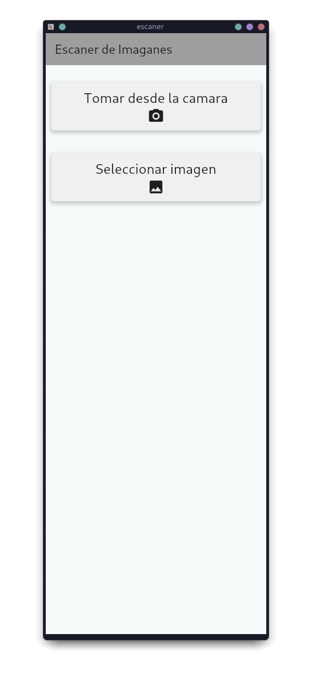
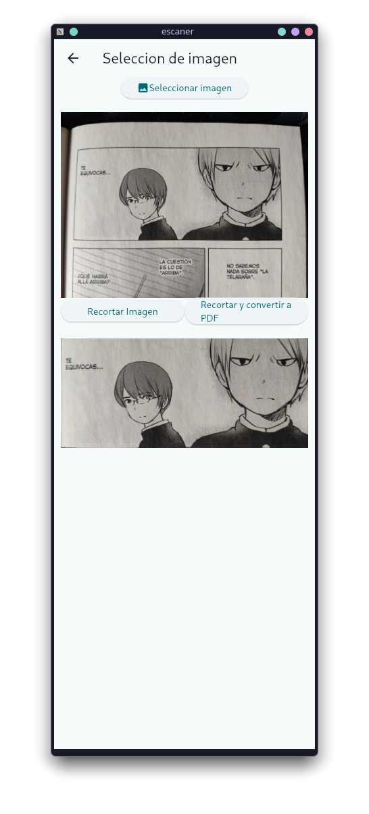
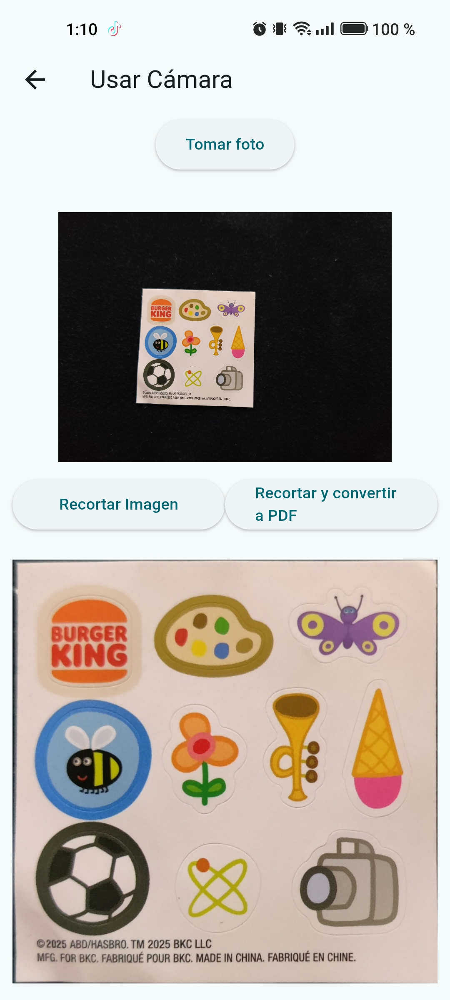

# escaner

Aplicacion de flutter que se conecta a una API la cual recorta imagenes con opencv, ademas de poder guardar los recortes en pdf o imagenes.

## Imagenes de muestra
Imagen de la pantalla principal de la app 
    

Imagen del apartado de seleccion de imagen
    

Imagen obtenidas de la camara
    
